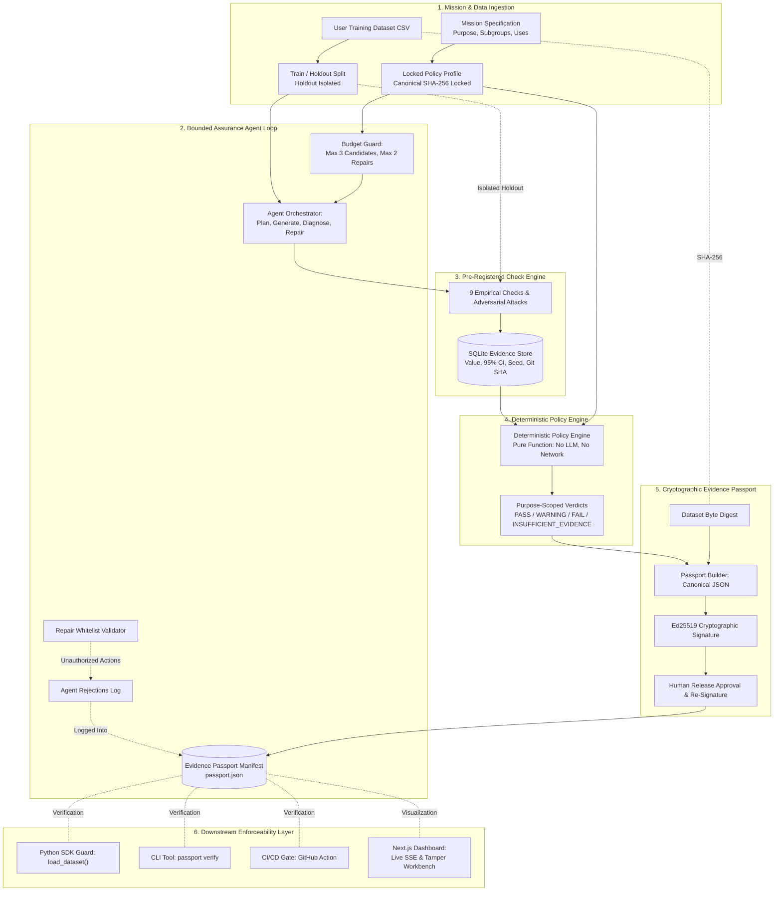

# SynPassport

> Purpose-bound assurance agent for synthetic data that issues signed, hash-bound Evidence Passports.

Question answered: *given this purpose and this policy, is there enough evidence to trust this dataset for this use — and can we enforce that decision?*

---

## Overview

### What the Project Does
**SynPassport** is an assurance and enforcement layer positioned between synthetic data generation and downstream production use. Instead of evaluating synthetic data with a single, uncalibrated quality score, SynPassport produces purpose-scoped, deterministic verdicts bound to a cryptographically signed **Evidence Passport**.

### The Problem It Solves
1. **Uncalibrated Global Scores**: A dataset scoring 85% on generic fidelity may be well-suited for integration tests but dangerous for clinical risk modeling due to high-variance subgroup errors or memorization risks.
2. **LLM Self-Grading & Goal Drift**: Generative agents left to inspect their own outputs tend to lower thresholds or declare success prematurely.
3. **No Downstream Enforceability**: Traditional synthetic data platforms output CSV files without provenance or cryptographic bindings. If a file is modified, tampered with, or used for an unapproved purpose, downstream training pipelines ingest it silently.

### How It Works at a High Level
1. **Purpose-First Ingestion**: The user declares an empirical mission (primary purpose, critical subgroups, risk mitigation level, and intended uses).
2. **Pre-Registered Policy Profiles**: The assurance policy is selected and hashed with SHA-256 before testing begins; thresholds are immutable in code.
3. **Separation of Powers**: An LLM agent (Groq or Gemini) diagnoses failures and selects from a strict whitelist of repairs (`regenerate_identifiers`, `switch_generator`, `tune_hyperparameters`) under hard budget limits ($\le 3$ candidates, $\le 2$ repairs). Invalid proposals are rejected and logged; if the LLM is unavailable, a rule-based planner takes over and the timeline says so.
4. **Isolated Adversarial Testing**: An independent evaluation engine runs up to 9 pre-registered checks (including identifier leakage, holdout-isolated DCR distance and membership inference attacks). The agent only observes aggregate metrics, never data rows.
5. **Deterministic Policy Engine**: A pure Python engine evaluates evidence rows against policy thresholds to assign independent verdicts (`PASS`, `WARNING`, `FAIL`, or `INSUFFICIENT_EVIDENCE`) per intended use.
6. **Cryptographic Binding & Human Accountability**: The run produces a canonical JSON Evidence Passport bound to the raw dataset bytes via SHA-256 and signed with Ed25519. Final release requires an accountable human approver.
7. **Downstream Enforcement**: The `load_dataset()` loader guard, `passport verify` CLI, and GitHub Action CI gate verify signatures, dataset hashes, and purpose compatibility before allowing consumption.

### Why the Project Is Useful
SynPassport converts synthetic data deployment from an unverified honor system into a transparent, verifiable audit trail. Consumers can verify whether a dataset supports audit and exhibits no unacceptable risk detected under the specified attacks for their exact use case.

---

## Key Features

- **Purpose-Scoped Verdicts**: Independent verdicts for distinct intended uses (e.g., `software_testing: PASS`, `clinical_ml: INSUFFICIENT_EVIDENCE`), replacing misleading aggregate quality scores.
- **Strict Separation of Powers**:
  - LLM agents propose repairs from a whitelisted set (`switch_generator`, `tune_hyperparameters`, `regenerate_identifiers`); they cannot modify thresholds or assign verdicts. If no LLM key is set, or the LLM call fails, a rule-based planner makes the same kind of whitelisted decision and the timeline says so.
  - The deterministic policy engine computes verdicts as a pure function.
  - Human release approval is cryptographically countersigned into the passport audit trail.
- **Pre-Registered Policy Profiles**: Versioned YAML profiles (`software-testing`, `ml-prototyping`, `ml-sensitive-v1`) with locked SHA-256 digests.
- **9 Pre-Registered Empirical Checks & Privacy Attacks**:
  1. *Schema Validity*: Types, domains, categorical distributions, and null structures.
  2. *Marginal Fidelity*: Kolmogorov-Smirnov and Total Variation distances.
  3. *Correlation Fidelity*: Pairwise association and covariance matrix alignment.
  4. *Downstream Utility (TSTR)*: Train on Synthetic, Test on Real baseline comparison.
  5. *Subgroup Utility*: Bootstrapped 95% confidence intervals on protected cohorts.
  6. *Distance to Closest Record (DCR)*: Empirical distance distributions vs locked holdout baseline.
  7. *Membership Inference Attack (MIA)*: Adversarial attack model AUC evaluation.
  8. *Subgroup Sample Size Sufficiency*: Statistical power analysis enforcing actionable refusal ("need $\ge N$ records").
  9. *Identifier Leakage*: Share of synthetic identifiers (transaction IDs, card hashes, IP addresses) copied from the real training data. Identifier columns are detected by code from the real data, never chosen by the agent, and are left out of distribution, distance and utility checks.
- **Explicit Uncertainty & Actionable Refusal**: Missing checks or wide confidence intervals yield `INSUFFICIENT_EVIDENCE`—never a weak or assumed pass.
- **Ed25519 Signed & Hash-Bound Evidence Passports**: Canonical JSON serialization signed with Ed25519 and bound to the dataset's exact SHA-256 byte digest.
- **Multi-Layer Enforcement**:
  - *Python SDK Loader Guard*: `synpassport.load_dataset(path, purpose=...)` raises `PassportError` (with a `reason_code` such as `DATASET_HASH_MISMATCH`) on modified bytes, bad signatures or unsupported purposes.
  - *CLI*: `passport verify` exits with explicit exit codes (`0` verified, `1` tampered/unsupported, `2` usage error).
  - *CI/CD Gate*: Composite GitHub Action failing CI pipelines on invalid passports.
- **Next.js 14 Dashboard & FastAPI Backend**: Full dashboard in `web/` featuring live SSE agent timelines, budget meters, confidence interval drill-downs, DCR histograms, and a live tamper workbench.
- **Deterministic Replay Mode**: With `SYNPASSPORT_REPLAY=1`, a run with the same dataset, mission, seed and policy version is served from `replay/` instead of calling the LLM again. A policy change invalidates old cache entries.

---

## Architecture

The system enforces strict trust boundaries between the exploratory agent, the evaluation engine, the deterministic policy engine, and downstream consumers.

---

## Detailed Technical Documentation

SynPassport provides comprehensive technical READMEs for every architectural component:

- 🛡️ **[Cryptographic Passport Engine (`synpassport.passport`)](file:///Users/vanshjain/Desktop/SynPassport/src/synpassport/passport/README.md)** — Ed25519 signing, RFC 8785 canonical JSON serialization, dataset byte hashing, DSSE & In-toto interop.
- 🔑 **[Trust Model & Governance Guide](file:///Users/vanshjain/Desktop/SynPassport/docs/TRUST_MODEL.md)** — Trusted Key Registry, Key ID derivation, key revocation, key expiration, threat model.
- 📊 **[Assurance & Statistical Checks Pipeline (`synpassport.checks`)](file:///Users/vanshjain/Desktop/SynPassport/src/synpassport/checks/README.md)** — All 8 statistical checks, formulas, DCR bootstrap CIs, MIA attack AUC, and sufficiency.
- 📜 **[Immutable Policy Engine (`synpassport.policy`)](file:///Users/vanshjain/Desktop/SynPassport/src/synpassport/policy/README.md)** — Policy YAML schema, canonical policy hashing, multi-purpose verdict matrix.
- 🤖 **[Autonomous Assurance Agent (`synpassport.agent`)](file:///Users/vanshjain/Desktop/SynPassport/src/synpassport/agent/README.md)** — State machine, LLM diagnosis, whitelisted repairs, replay cache, prompt injection defenses.
- 🔒 **[Verification SDK & Data Guard (`synpassport.sdk`)](file:///Users/vanshjain/Desktop/SynPassport/src/synpassport/sdk/README.md)** — 7-step fail-closed verification pipeline, TOCTOU-safe dataset loader (`guard.py`), reason codes.
- 💻 **[Command-Line Interface (`synpassport.cli`)](file:///Users/vanshjain/Desktop/SynPassport/src/synpassport/cli/README.md)** — `passport verify`, `issue`, `approve`, `inspect`, and `keyreg` subcommands.
- 🌐 **[REST API & Async Server (`synpassport.api`)](file:///Users/vanshjain/Desktop/SynPassport/src/synpassport/api/README.md)** — FastAPI web server, background jobs, SSE streaming, zero-disk verification, approval auth.
- 🗄️ **[Evidence Store (`synpassport.evidence`)](file:///Users/vanshjain/Desktop/SynPassport/src/synpassport/evidence/README.md)** — SQLite audit trail persistence.
- ⚙️ **[Synthetic Data Generators (`synpassport.generators`)](file:///Users/vanshjain/Desktop/SynPassport/src/synpassport/generators/README.md)** — GaussianCopula, CTGAN, and Differential Privacy (DP) training integrations.
- 🎯 **[Mission Profile (`synpassport.mission`)](file:///Users/vanshjain/Desktop/SynPassport/src/synpassport/mission/README.md)** — Intent specification.
- 🔐 **[Security Architecture & Defenses](file:///Users/vanshjain/Desktop/SynPassport/docs/SECURITY.md)** — Complete threat model, TOCTOU defense, prompt sanitization, token auth.
- 📜 **[Detailed Changelog & Commit Log](file:///Users/vanshjain/Desktop/SynPassport/CHANGELOG.md)** — Comprehensive record of every commit, feature addition, and bug fix over time. Automatically updated on every git commit.




### Trust Boundaries & Threat Model

| Threat | System Mitigation |
|---|---|
| **LLM lowers its own bar** | Thresholds reside exclusively in pre-registered, hashed YAML files. The agent has no write access to thresholds. |
| **P-hacking / Infinite repairs** | Hard budget limits in code: max 3 candidates, max 2 repairs. Attempt counts are recorded in the signed passport. |
| **Holdout leakage to agent** | Holdout datasets are strictly isolated within the evaluation engine. The agent context receives aggregate metrics only. |
| **Dataset tampering in storage/transit** | Raw dataset bytes are hashed with SHA-256. Altering even a single cell or byte causes instant verification failure. |
| **Passport forgery or tampering** | Canonicalized JSON signed via Ed25519; modifying any field invalidates the digital signature. |
| **Prompt injection via dataset values** | Column values/headers are sanitized. The agent has no arbitrary code execution capability. |

---

## Repository Layout

```
SynPassport/
├── policies/                    # Versioned YAML policy profiles
│   ├── software-testing.yaml    # Functional testing profile (schema, identifier leakage, marginal fidelity)
│   ├── ml-prototyping.yaml      # General ML prototyping (adds correlation & utility)
│   └── ml-sensitive-v1.yaml     # High-assurance profile (adversarial attacks + subgroup CI)
├── src/synpassport/             # Core Python package
│   ├── agent/                   # Agent loop, tool registry, and repair whitelist
│   ├── api/                     # FastAPI backend (routers for runs, evidence, DCR, SSE, policies, verify)
│   ├── checks/                  # 9 pre-registered checks, privacy attacks, identifier handling
│   ├── cli/                     # argparse CLI entrypoint (`passport`)
│   ├── evidence/                # SQLite append-only evidence store and models
│   ├── generators/              # Synthetic data generator interfaces (Gaussian Copula, CTGAN)
│   ├── mission/                 # Mission schema and restricted subgroup expression parser
│   ├── passport/                # Canonical JSON serializer, Ed25519 signer, schema validator
│   ├── policy/                  # Policy loader, canonical hasher, deterministic engine
│   └── sdk/                     # verify() SDK and load_dataset() runtime loader guard
├── web/                         # Next.js 14 web dashboard (TypeScript, Tailwind CSS)
│   ├── src/app/                 # App Router pages, layout, and global styling
│   ├── src/components/          # Dashboard components for all 7 screens
│   ├── src/types/               # TypeScript interface declarations
│   ├── src/fonts/               # Bundled wordmark font (Source Serif 4, SIL OFL)
│   └── Dockerfile               # Production Next.js container configuration
├── examples/                    # Synthetic demo datasets (card transactions, heart disease)
├── .github/actions/verify/      # Composite GitHub Action for CI/CD pipeline gating
├── replay/                      # Local cache for replay mode (contents are git-ignored)
├── scripts/                     # End-to-end verification and pipeline scripts
├── tests/                       # Unit, property, and integration test suite (143 tests)
├── docker-compose.yml           # Multi-container orchestration (API + Web)
├── Dockerfile                   # Python backend container configuration
└── pyproject.toml               # Python project configuration, dependencies, and entrypoints
```

---

## Quickstart & Docker Services

Docker and a local run use the same ports: the API on **8765** and the dashboard on **3005**.

```bash
# Standard live run
docker compose up --build

# Replay mode: re-serves runs already cached in replay/ (run each demo once live first)
SYNPASSPORT_REPLAY=1 docker compose up --build      # PowerShell: $env:SYNPASSPORT_REPLAY=1; docker compose up --build
```

- **Web Dashboard**: [http://localhost:3005](http://localhost:3005)
- **FastAPI Documentation**: [http://localhost:8765/docs](http://localhost:8765/docs)
- **API Health Endpoint**: [http://localhost:8765/health](http://localhost:8765/health)

Docker Compose reads `LLM_API_KEY` (and optionally `LLM_MODEL`) from `.env`. Stop a locally running API or
dashboard first, since they use the same ports. To use other ports, set `API_PORT` and/or `WEB_PORT`, for example
`API_PORT=8800 WEB_PORT=3100 docker compose up --build` (PowerShell: `$env:API_PORT=8800; $env:WEB_PORT=3100;
docker compose up --build`); the dashboard is built to call the API port you choose.

The Docker image does not include CTGAN (it needs PyTorch); CTGAN requests fall back to the Gaussian copula and the
passport records that. For real CTGAN training, run locally with `pip install -e ".[ctgan]"`.

---

## Local Installation

### Prerequisites
- Python 3.11+
- Node.js 20+ and npm 10+ (for web dashboard)

### Backend Installation

```bash
# Clone and configure environment
git clone https://github.com/nishankkhadpe7-afk/SynPassport.git
cd SynPassport
python -m venv .venv
source .venv/bin/activate  # On Windows: .venv\Scripts\activate

# Install package in development mode
pip install -e ".[dev]"
cp .env.example .env
```

### Frontend Installation

```bash
cd web
npm install
npm run build
```

### Run locally

```bash
# Terminal 1: API on http://127.0.0.1:8765
PYTHONPATH=src python -m uvicorn synpassport.api.main:app --host 127.0.0.1 --port 8765

# Terminal 2: dashboard on http://localhost:3005
cd web
npm run start -- -p 3005
```

On Windows without Docker, double-click `start-synpassport.bat` to do both. The dashboard reads the API address from
`web/.env.local` (`NEXT_PUBLIC_API_URL=http://127.0.0.1:8765`). Put your LLM key in `.env`
(`LLM_API_KEY=...`, a Groq `gsk_` key works); without one, a rule-based planner makes the repair decisions.

### Configuration (`.env`)

| Variable | Purpose |
|---|---|
| `LLM_API_KEY` | Groq (`gsk_...`) or Gemini key for the repair agent. Empty = rule-based planner. `GROQ_API_KEY` also works. |
| `LLM_MODEL` | Optional model override (Groq default: `qwen/qwen3.8-27b`). |
| `DATA_DIR` | Where runs, evidence and the server signing keypair are stored (default `./data`). |
| `SYNPASSPORT_REPLAY` | `1` = serve identical runs from `replay/`. |
| `SYNPASSPORT_APPROVER_TOKEN` | If set, approving a release requires this value in the `X-Approver-Token` header. |
| `SYNPASSPORT_PUBLIC_KEY` | Trusted issuer public key for `passport verify` and the SDK. |
| `CORS_ORIGINS` | Extra browser origins allowed to call the API (comma separated). Ports 3000, 3001 and 3005 on localhost are allowed by default. |

Optional: `pip install -e ".[ctgan]"` installs CTGAN (with PyTorch) for real CTGAN training.

---

## Usage Guide

### 1. Command-Line Interface (`passport`)

The CLI exposes four subcommands for verification, issuance, approval, and inspection.
Create a signing keypair first with `python -m synpassport.passport.keygen` (writes `keys/ed25519_private.pem`
and `keys/ed25519_public.pem`). Passports issued by the dashboard API are signed with the server key in
`data/keys/api_private.pem`; verify them with `data/keys/api_public.pem`.

```bash
# 1. Cryptographically verify a synthetic dataset against an Evidence Passport.
#    The issuer's public key must be supplied (or set SYNPASSPORT_PUBLIC_KEY); keys found
#    next to the passport are never trusted.
passport verify data/candidate.csv data/candidate.passport.json --purpose software_testing \
  --public-key keys/ed25519_public.pem

# 2. Issue a new signed Evidence Passport for evaluated data
passport issue --data data/real.csv --synth data/candidate.csv --policy software-testing \
  --key keys/ed25519_private.pem --output passport.json

# 3. Countersign human release approval
passport approve passport.json --approver auditor@enterprise.org --key keys/ed25519_private.pem

# 4. Inspect passport contents and audit trail in JSON format
passport inspect passport.json --json
```

**Standard Exit Codes**:
- `0`: Verified successfully (`OK`).
- `1`: Tampered or unsupported (`DATASET_HASH_MISMATCH`, `SIGNATURE_INVALID`, `PURPOSE_UNSUPPORTED`, `APPROVAL_MISSING`).
- `2`: Malformed passport or usage error (`PASSPORT_MALFORMED`, `PURPOSE_UNKNOWN`).

---

### 2. Python SDK & Runtime Loader Guard

Integrate dataset verification directly into model training scripts:

```python
import synpassport
from synpassport import PassportError

# Protected ingestion: verifies Ed25519 signature, dataset SHA-256, and purpose clearance
try:
    df = synpassport.load_dataset(
        dataset_path="data/synthetic_candidate.csv",
        purpose="clinical_ml",
        passport_path="data/synthetic_candidate.passport.json",
        public_key="keys/ed25519_public.pem",  # trusted issuer key
    )
    print(f"Dataset verified for clinical ML! Loaded {len(df)} records.")
except PassportError as err:
    print(f"Data ingestion halted by loader guard: [{err.reason_code}] {err.message}")
    # Downstream model training is prevented from running on unverified or tampered data
```

---

### 3. CI/CD Pipeline Gate (GitHub Action)

Enforce assurance checks directly in your pull request workflow using the pre-built composite action:

```yaml
name: Model Training Pipeline

on: [push, pull_request]

jobs:
  train:
    runs-on: ubuntu-latest
    steps:
      - uses: actions/checkout@v4

      - name: Verify Synthetic Data Assurance Gate
        uses: ./.github/actions/verify
        with:
          dataset: "data/synthetic_candidate.csv"
          passport: "data/synthetic_candidate.passport.json"
          purpose: "clinical_ml"
          allow-warning: "false"
          # Trusted issuer key, kept where the data author cannot replace it
          public-key: "trusted-keys/synpassport_issuer.pem"

      - name: Train Downstream Model
        run: python -m model.train --data data/synthetic_candidate.csv
```

---

## Next.js Web Dashboard

The web dashboard ([`web/`](web/)) provides a 7-screen assurance cockpit:

1. **Mission Setup**: Upload a dataset, declare the target column, a critical subgroup (`age >= 65`) and intended uses. The policy is chosen from the intended uses (the strictest one needed) and its real SHA-256 digest is fetched from `GET /policies/{id}`. Warns when the target or subgroup column is not in the file.
2. **Agent Timeline**: Live Server-Sent Events stream (`/runs/{id}/events`) of candidate generation, evaluations, agent decisions (who decided and why), whitelisted repairs and rejected proposals, with candidate and repair budget meters.
3. **Verdict Board**: One card per intended use with the policy's required checks; the reasons are built from the signed candidate's actual check results.
4. **Evidence Drill-Down**: Every check with its value, 95% confidence interval and policy threshold, labelled with the candidate the passport signs, plus distance-to-closest-record histograms computed from the run's own files (`GET /runs/{id}/dcr`).
5. **Sufficiency Panel**: Subgroup power analysis: how many records the critical subgroup has, how many it needs, and the resulting confidence-interval width.
6. **Passport Panel**: Dataset hash, policy hash and Ed25519 signature, the canonical JSON with copy and download, human approval (`POST /runs/{id}/approve`, optionally protected by `SYNPASSPORT_APPROVER_TOKEN`), and server-side verification.
7. **Tamper Test**: Loads the exact file the passport signs, lets you change one cell (or edit freely), recomputes the SHA-256 in the browser and asks the server to verify. A changed file fails with `DATASET_HASH_MISMATCH`, and the loader-guard panel shows the `PassportError` a training script would get.

---

## 90-Second Demo Runbook

Reference: [`docs/instructions.md`](docs/instructions.md)

### Demo datasets

Two synthetic demo datasets (made-up records, no real people) are in [`examples/`](examples/):

| File | Rows | Setup | What it shows |
|---|---|---|---|
| `card_transactions_4000.csv` | 4,000 | Target `is_fraud`, subgroup `age >= 65` | Candidate 1 copies real transaction IDs, card hashes and IPs, so **identifier leakage fails**. The agent applies `regenerate_identifiers`; candidate 2 passes software testing. With ML uses ticked, ML prototyping still fails (utility too low for a rare fraud label): approved for testing, blocked for ML. |
| `heart_disease_5000.csv` | 5,000 | Target `target`, subgroup `age >= 65`, tick Clinical ML | The clinical policy (`ml-sensitive-v1`) is selected. Candidate 1 passes software testing and ML prototyping but is **insufficient evidence** for clinical ML (membership-inference CI crosses 0.55); the agent tries CTGAN and longer training, and the best candidate is kept. |

### Golden-Path Presentation Script

| Step | Action | Verifies Principle |
|---|---|---|
| **1. Purpose first** | Load `examples/card_transactions_4000.csv`, set target `is_fraud`, tick the intended uses. The policy profile and its SHA-256 are shown and locked before any data is generated. | Pre-registration and purpose binding |
| **2. Find the leak** | Start the run. Candidate 1 fails `identifier_leakage` (real IDs copied). | Evidence over trust |
| **3. Bounded repair** | The agent (Groq, or the rule-based planner) proposes `regenerate_identifiers`; code validates it against the whitelist and budget (max 3 candidates, 2 repairs). Candidate 2 has fresh IDs in the same format. | Bounded, auditable agent |
| **4. Purpose-scoped verdicts** | Software testing passes; ML uses fail on utility. Same file, different answers per use. | No single misleading score |
| **5. Passport and tamper test** | Approve the passport, then in *Tamper test* change one cell: verification fails with `DATASET_HASH_MISMATCH`. | Cryptographic binding |
| **6. Loader guard** | `synpassport.load_dataset(path, purpose=...)` refuses the modified file before any training starts. | Enforcement in code |

> **Presentation Note**: Run each demo once live before presenting. Then, if the network or LLM is slow, set `SYNPASSPORT_REPLAY=1` and the same runs are served from `replay/`. Without an LLM key the rule-based planner still makes whitelisted repairs.

---

## Development & Testing

```bash
# Run unit, property, and integration tests (143 tests)
pytest -q

# Run code style and linter checks
python -m ruff check .

# Run static type checks across all packages
python -m mypy src

# Run standalone scripted assurance pipeline
python scripts/run_pipeline.py
```

---

## Core Guarantees & Non-Claims

1. **Separation of Powers**:
   - The LLM agent explores, diagnoses, and suggests parameter repairs from an explicit whitelist.
   - The deterministic policy engine computes all per-use verdicts. The LLM never assigns verdicts.
   - Missing or errored evidence resolves to `INSUFFICIENT_EVIDENCE`, never `PASS`.

2. **Cryptographic Binding**:
   - Every Evidence Passport is canonicalized (sorted keys, stable formatting), hashed with SHA-256, and signed with Ed25519.
   - Datasets are bound by the SHA-256 hash of their raw file bytes.

3. **Explicit Non-Claims**:
   - Does not provide absolute mathematical proof of secrecy or confidentiality.
   - Does not certify statutory regulatory adherence (e.g., HIPAA, GDPR, DPDP).
   - Does not replace human release approval when required by policy.
   - Evaluates empirical evidence under specified attacks and pre-registered statistical checks; supports audit.
