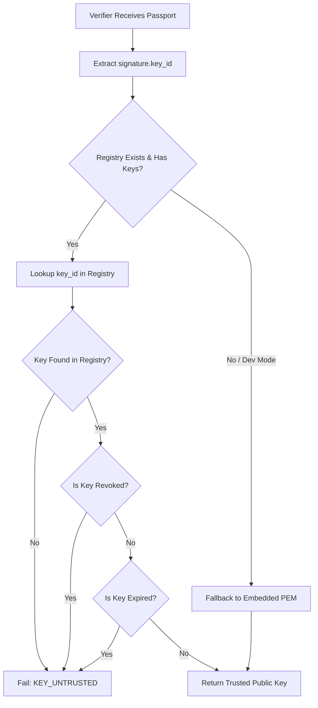

# Cryptographic Trust Model & Key Governance

SynPassport implements a zero-trust model for synthetic data assurance. A passport signature is meaningless without an authoritative, tamper-proof **Trust Anchor**.

---

## 1. Key Identification & Derivation (`Key ID`)

Public keys are identified by a deterministic `key_id`:
1. Extract raw 32-byte public key representation (Ed25519 raw bytes).
2. Calculate SHA-256 digest over the 32 raw bytes.
3. Encode as a 64-character hexadecimal string.

```
Raw Public Key (32 bytes) ──► SHA-256 Digest ──► Hex String (Key ID)
```

---

## 2. Trusted Key Registry (`key_registry.json`)

The verifier maintains an immutable or pinned key registry mapping labels to fingerprints, expiration dates, and revocation statuses:

```json
{
  "keys": {
    "prod-issuer-2026": {
      "fingerprint": "8f3e2a1b9c0d4e5f6a7b8c9d0e1f2a3b4c5d6e7f8a9b0c1d2e3f4a5b6c7d8e9f",
      "public_key_pem": "-----BEGIN PUBLIC KEY-----
...
-----END PUBLIC KEY-----",
      "added_at": "2026-01-01T00:00:00Z",
      "expires_at": "2027-01-01T00:00:00Z",
      "revoked": false,
      "revocation_reason": null,
      "comment": "Primary Production Issuer Key"
    }
  }
}
```

---

## 3. Trust Resolution Workflow (`resolve_trusted_key`)



---

## 4. Threat Matrix & Mitigations

| Threat | Attack Vector | SynPassport Defense |
| :--- | :--- | :--- |
| **Self-Signed Passport** | Attacker generates keypair and embeds pubkey in passport. | Verifier checks `key_id` against `TrustedKeyRegistry`. Unenrolled keys fail with `KEY_UNTRUSTED`. |
| **Key Compromise** | Issuer key is leaked to an adversary. | Admin runs `passport keyreg revoke` to flag key as revoked in registry. |
| **Stale Passports** | Dataset becomes vulnerable to newly discovered attacks years later. | Expiry enforcement via `--max-age-days` and key expiration timestamps. |
| **Policy Modification** | Creator relaxes policy thresholds post-issuance. | Policy canonical hash `policy.sha256` is signed inside passport payload. |
