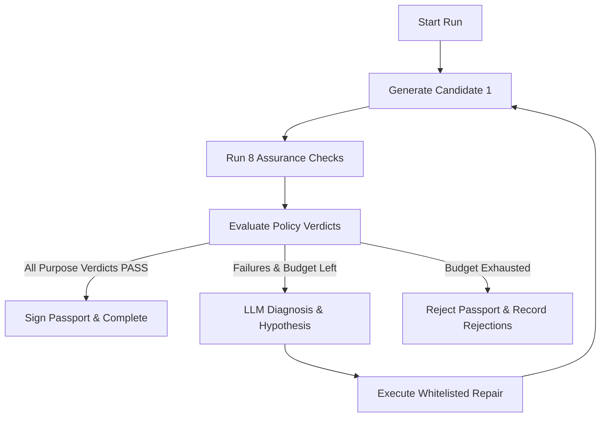

# Autonomous Assurance Agent (`synpassport.agent`)

The `synpassport.agent` module provides an autonomous loop that iteratively generates synthetic dataset candidates, executes the statistical assurance pipeline, diagnoses policy failures via LLM reasoning, applies whitelisted repair strategies, and verifies output compliance.

---

## Submodule Architecture

- [`loop.py`](file:///Users/vanshjain/Desktop/SynPassport/src/synpassport/agent/loop.py): Core loop controller (`AssuranceAgentLoop.run`).
- [`llm.py`](file:///Users/vanshjain/Desktop/SynPassport/src/synpassport/agent/llm.py): Provider-agnostic LLM interface supporting OpenAI, Anthropic, and local deterministic mock models.
- [`prompts.py`](file:///Users/vanshjain/Desktop/SynPassport/src/synpassport/agent/prompts.py): System prompts, context assembly, and **prompt injection defenses**.
- [`repairs.py`](file:///Users/vanshjain/Desktop/SynPassport/src/synpassport/agent/repairs.py): **Strictly whitelisted repair executor** (`tune_hyperparameters`, `switch_generator`, `enable_dp_training`).
- [`tools.py`](file:///Users/vanshjain/Desktop/SynPassport/src/synpassport/agent/tools.py): Agent tool declarations provided to the LLM.
- [`cache.py`](file:///Users/vanshjain/Desktop/SynPassport/src/synpassport/agent/cache.py): Deterministic `ReplayCache` for exact execution replay without LLM calls.
- [`explanation.py`](file:///Users/vanshjain/Desktop/SynPassport/src/synpassport/agent/explanation.py): Natural language reasoning and verdict narrative generator.

---

## 1. Autonomous Optimization Loop (`loop.py`)

The `AssuranceAgentLoop` executes the following state machine:

### Budget Bounds
The agent's loop is bounded by constraints defined in `policy.budget`:
- `max_candidates`: Maximum synthetic dataset candidates generated (default `3`).
- `max_repairs`: Maximum repair iterations attempted (default `2`).

---

## 2. Whitelisted Repair Execution (`repairs.py`)

To guarantee security and eliminate code execution vulnerabilities, the agent **cannot execute arbitrary Python code or shell scripts**. The repair module supports only three registered parameter mutations:

1. **`tune_hyperparameters`**:
   - Adjusts generator parameters (e.g. `epochs`, `batch_size`, `embedding_dim`, `pac`).
2. **`switch_generator`**:
   - Swaps underlying algorithm (e.g. `GaussianCopula` $\leftrightarrow$ `CTGAN`).
3. **`enable_dp_training`**:
   - Activates Differential Privacy with strict privacy budget bounds (`dp_enabled=True`, `dp_epsilon=3.0`, `dp_delta=1e-5`).

---

## 3. Replay Mode & Deterministic Caching (`cache.py`)

When running in `--replay-dir` mode:
1. LLM invocations are bypassed; cached hypotheses and tool calls are loaded directly from `ReplayCache`.
2. Synthetic CSV files are re-generated if missing.
3. **Dynamic Re-binding**: The dataset SHA-256 hash and canonical CSV hash are dynamically computed from the newly output file, ensuring the generated passport cryptographic signature matches the current filesystem state.

---

## 4. Prompt Injection Defenses (`prompts.py`)

To prevent adversarial prompt injection attacks from malicious column names or data values:

- **`sanitize_column_name(col)`**: Strips non-alphanumeric characters, enforces `[a-zA-Z0-9_]`, truncates to max 64 chars.
- **`sanitize_schema_summary(df)`**: Emits aggregate statistical metadata only (column names, data types, row counts). **Zero raw sample rows or cell values are ever transmitted to the LLM.**
- **`format_policy_summary(policy)`**: Formats policy thresholds as `READ-ONLY / LOCKED CONSTRAINTS` in system prompts.
